# Dokumenttien laatiminen

Tämän ohjesivun sisältö:

- Dokumentoinnin periaatteet
- Uuden sivudokumentin laatiminen, muokkaaminen ja päivittäminen
- Taulukoiden tekeminen piazzalla
- Uuden tiedostodokumentin laatiminen, tiedoston nostaminen piazzalle, muokkaaminen ja päivittäminen
- Dokumenttien linkitys
- Kuvan liittäminen dokumenttiin
- Dokumenttien poistaminen
- Dokumenttien ja kansioiden muut tiedot

Lue myös [dokumenttien ylläpito](dokumentin_yllapito) ja [Toimintaohjeet](toimintaohjeet).

----

## Uuden dokumentin laatimisen periaatteita

Jotta prosessidokumentit (prosessikaaviot, prosessikuvaukset, apteekkiohjeet, toimintaohjeet, kokousmuistiot, sisäisten arviointien muistiot) ovat ulkoasultaan yhdenmukaiset, niille kannattaa laatia jo prosessikehittämisen alussa **mallipohjat**.

Tässä esimerkki prosessikuvauksen mallipohjasta, kun dokumentti laaditaan sivuna. 

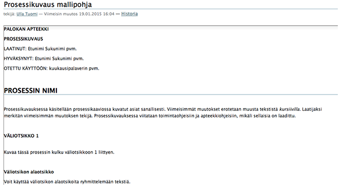

----

Näin tunnistetiedot, fontit ja otsikot tulevat kohdalleen, eikä niitä tarvitse miettiä joka kerta erikseen.

Dokumenttien yhtenäinen ulkoasu näyttää mukavalta, kertoo yhdenmukaisista toimintatavoista myös dokumentoinnissa. 

----

Jos mallipohjat on jokaiselle dokumenttityypille, niille kannattaa laatia oman kansionsa Mallipohjat, josta pohjat löytyvät helposti.

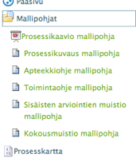

Kansioiden lisäämisestä ja ylläpidosta on [tarkempaa ohjetta](kansiot).

----

Dokumentteja voi laatia piazzalle  kahdella tapaa: **joko suoraan sivuna** tai **nostaa liitetiedostona** (tiedostona vanha tapa).

Nykyisin suositellaan, että kaikki perustekstit (Wordit, esim. kuvaukset, ohjeet ja muistiot) laaditaan sivuna, jolloin niiden hallinta on helpompaa ja yksinkertaisempaa. 
Niitä pystyy muokkaamaan suoraan piazzalla, myös hakutoiminto etsii tekstin (esim. ohjeen) sisällöstä.

Jos tekstissä on taulukko tai muita erikoismerkkejä, tekstit laaditaan teksinkäsittelyohjelmalla ja käsitellään piazzalla tiedostona, näin myös powerpoint-, pdf- ja excel-muotoiset.

Käytännössä vain prosessikaaviot, mittarit ja koulutusmateriaali vaativat tiedostokäsittelyn, muut voidaan laatia helposti sivuna.

----

## Uuden sivudokumentin laatiminen ja päivittäminen

Käytettäessä mallipohjaa (suositus) avataan Mallipohja -kansio tai kansio, jossa mallipohja on.

Valitaan kansion vihreästä valikosta **Sisältö** -> ruksataan pohja -> valitaan **Kopio**.

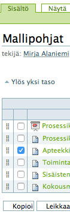

Tämän jälkeen avataan kansio, johon pohja halutaan siirtää (laatia uusi dokumentti). 
Valitaan vihreästä valikosta Sisältö -> valitaan **Leikkaa**, jolloin pohja kopioituu sopivaan kansioon.

----

Tämän jälkeen avataan siirretty pohja -> valitaan **Muokkaa -> muutetaan otsikko, tunnistetiedot** ym.
Nyt pääset kirjoittamaan tekstiä. **Tallenna** aina välillä (alaosassa Tallenna).

Sitten kun jatkat kirjoittamista, avaa dokumentti, valitse Muokkaa, muuta tarvittaessa pvm ja jatka kirjoittamista.

Sitten kun dokumentti on valmis, se lähetetään [wiki:DokumentinJulkaiseminen hyväksyttäväksi]. 

Päivitettäessä dokumenttia (dokumentti on jo hyväksytty) muuttuneet kohdat kirjoitetaan esim. kursiivilla tai miten muutokset on sovittu merkittäväksi. Kun dokumenttia muutetaan seuraavan kerran, kursiivit oikaistaan ja uudet muuttuneet kohdat kursiivilla. Kursiivia käytetään vasta kun dokumentit on hyväksytty.

Muistetaan muuttaa aina myös päivämäärä ja laatija tarvittaessa. Myös päivitetyt dokumentit lähetetään [wiki:DokumentinJulkaiseminen hyväksyttäväksi]

Jos et käytä mallipohjaa, avaa kansio, johon haluat laatia dokumentin. Valitse valikosta **Lisää uusi** -> **Sivu**. Avaa sitten ko. sivu -> **Muokkaa** -> aloita kirjoittaminen.

Uusi dokumentti menee alimmaiseksi. Voit siirtää sen haluamaasi paikkaan samalla tavalla kuin  [wiki:KansionTekeminen kansioiden sisältöä järjestetään].

----

## Kuvaukset ja ohjeet aikaisemmin olleet tiedostoina

Aikaisemmin käytäntönä oli, että dokumentit laadittiin tietokoneella tiedostoina, jotka nostettiin piazzalle. 
Tämä käytäntö on kerrottu seuraavassa otsikossa.

__Suositeltavaa on__, että dokumentin seuraavan päivityksen yhteydessä tekstit tehdään sivuina, jotta niiden käsittely jatkossa on helpompaa.

Se tehdään näin:

- Kopioi mallipohja ko. kansioon tai laadi uusi sivu edellä kuvatun mukaisesti.
- Avaa päivitettävä tiedosto.
- Maalaa teksti alusta loppuun (yläotsikkoa ei pysty maalaamaan ainakaan helposti), vie se leikepöydälle (contrl c).
- Avaa äsken tehty sivu, valitse muokkaa, vie kursori tekstikenttään ja liitä tiedoston teksti (control w), jolloin teksti siirtyy sivulle. Lopuksi tallenna.
- Tarvittaessa poista ylimääräiset rivit, lihavoi/kursivoi sekä kirjoita päivitettävä teksti ja lopuksi tallenna.
- Poista vanha tiedosto.

Siirtymisen tiedostoista voi tehdä myös "urakkana", esim. joku keskitetysti tekee siirrot.
Muistetaan muuttaa tekijät oikeiksi.

----

## Uuden tiedostodokumentin laatiminen

- Avataan mallipohja -> tallennetaan se tietokoneelle (esim. työpöydälle) mahdollisimman kuvaavalla lyhyellä nimellä.
- Muutetaan tunnistetiedot ja jatketaan kirjoittamista tekstinkäsittelyohjelmalla.
- Tallennuksen jälkeen tiedosto siirretään piazzalle.
- Myös keskeneräiset kannattaa nostaa piazzalle. 

### Tiedoston nostaminen piazzalle

Avataan kansio, johon tiedosto halutaan liittää. 
Valitaan vihreästä valikosta **Lisää uusi** -> **Tiedosto**.

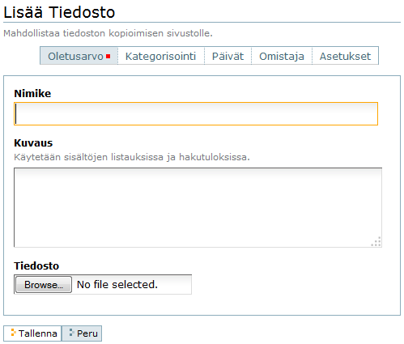

Kirjoitetaan nimikkeeksi tiedoston nimi. 

Kuvaus ei ole pakollinen, mutta suositeltava. Siinä voi hieman tarkentaa mitä tämä liitetiedosto pitää sisällään tai jotain muuta siihen liittyvää tietoa.

Varsinainen tiedosto poimitaan omalta koneelta **Browse** tai **Selaa** -toiminnolla.

Lopuksi **Tallenna**, jolla tiedosto siirtyy fyysisesti piazzalle. 
Työpöydältä käydään poistamassa tiedosto, jotta sinne ei kerry tiedostoja.

### Tiedoston muokkaaminen ja täydentäminen

Tiedostoja ei voi muokata suoraan piazzalla, vaan ne on aina tehtävä tekstinkäsittelyohjelmalla.

Suositeltavaa on, että päivitettävä tiedosto avataan piazzalla, jotta päivitetään viimeisintä versiota.

Tiedosto tallennetaan tietokoneelle ja tehdään muutokset koneelle.

Jos tiedostodokumentti on jo hyväksytty, muuttuneet kohdat esim. kursiivilla tai miten muutokset on sovittu merkittäväksi.

Muistetaan muuttaa aina myös päivämäärä ja laatija tarvittaessa.

Päivitetty tiedosto mostetaan piazzalle seuraavasti:

- Avataan päivitettävä tiedosto
- Valitaan **Muokkaa**
- Valitaan **Korvaa uudella tiedostolla**, haetaan tiedosto koneelta, lopuksi **Tallenna**.

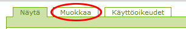

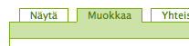

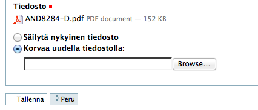

----

## Taulukoiden laatiminen

Piazzalla voi laatia myös taulukoita joko omiksi dokumenteikseen (esim. koulukortit, projektisuunnitelmat) tai taulukoita sivudokumenttien tekstiin.

Taulukon laatiminen tekstidokumenttiin tehdään Muokkaa-tilassa:

- Mene dokumentissa kohtaan, johon haluat taulukon
- Valitse ylläolevasta valikosta taulukko
- Lisää sarakkeiden ja rivien määrä
- Tallenna tai täytä taulokkoa samantien

Jos laaditaan taulukkodokumentteja (esim. koulutuskortteja), tehdään näin:

- Lisää uusi sivu
- Kirjoita Nimike ja lisää tekstiin (kommentti) taulukko em. opastuksen mukaisesti

Taulukossa ei ole kaikkia excelin hienouksia, mutta perustaulukon tekemiseen varsin kätevä, esim.rivejä ja sarakkeita on helppo lisätä tai poistaa.

## Dokumenttien linkitys

Piazzalla on mahdollista myös dokumenttien linkitys, esim. asiakastyytyväisyystutkimus markkinoinnin ja asiakaspalveluprosessien mittarina tai halutaan linkittää dokumenttia sivulta toiselle.

Ylläpidon hallinnan kannalta on tärkeää, että dokumentti on vain yhdessä paikassa.

Linkitys voidaan tehdä kahdella tavalla.

### Linkitys sivulta dokumenttiin

!!! note "Huom"
	Linkitys ei toimi Internet Explorerilla. 
	Käytä Mozilla Firefoxia tai Google Chromea linkkien lisäämiseen.

Sivueditorin (tekstieditorin) tulee olla muotoa [TinyMCE](sivueditorit/#tinymce-editori). 
Näkyy ja muutetaan tarvittaessa piazzan pääsivulla Asetukset.

* Avataan/lisätään sivudokumentti, johon linkitys halutaan.
* Valitaan **Muokkaa**, "maalataan" linkitettävä sana/-t, valitaan editoripalkista **Lisää/muuta linkki** (ketju).
* Näyttöön avautuu Lisää/muokkaa -näkymä.
* Jos halutaan linkittää piazzalla oleva dokumentti, valitaan sisäisestä linkitettävä dokumentti, eli avataan kansioita niin pitkälle, että dokumentti löytyy.
* Ruksataan linkitettävä dokumentti ja lopuksi OK. Linkitys näkyy dokumentissa alleviivauksena. 
* Vastaavasti linkitetään ulkoinen linkki (nettisvu).

Tällä tavalla on erityisen helppoa linkittää sivuna laadittuun dokumenttiin muita dokumentteja, esim. kaikki toimintaohjeet toimintaohjeluetteloon.

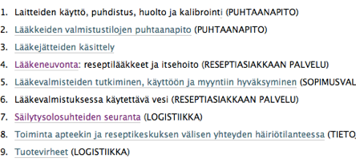

### Myös näin on mahdollista linkittää

Etenkin aikaisemmin suosittiin tätä kategorisoinnin kautta tapahtuvaa linkitystä, joka tehdään näin.

* Luodaan tai avataan sivu, johon linkitys halutaan.
* Valitaan **Muokkaa**, valitaan "Kategorisointi", avautuvalta sivulta valitaan **Samasta aiheesta** ja **Lisää** -toiminnolla haetaan sopiva dokumentti linkitettäväksi avaamalla kansioita niin pitkälle, että dokumentti löytyy, ja lopuksi "Tallenna".
* Makuasia kumpaako tapaa haluaa käyttää.

----

## Kuvan liittäminen dokumenttiin 

Sivudokumenttiin on helppo liittää kuva esim. havainnollistaakseen tekstiä.

Kuvia voi lisätä tekstiin näin (ensin kuva haetaan piazzalle omaan kansioon):

- Avaa oma kansio (löytyy ylhäältä oikealta)
- Lisää uusi kuva, hae se tietokoneeltasi ja lopuksi tallenna (siis jos kuvaa ei ole piazzalla)
- Avaa dokumentti, johon haluat liittää kuvan. Valitse Muokkaa ja mene siihen kohtaan, johon haluat kuvan.
- Valitse ylläolevasta valikosta vasemmasta laidasta ”kuvaruutu” (lisää/muuta kuva).
- Valitse näkymän oikeasta kulmasta keskimmäinen List view.
- Valitse Pääsivu, jolloin näkyviin tulee kansiorakenteenne piazzalla.
- Valitse sieltä Käyttäjät -> oma kansiosi ja sieltä valitse kuva ja lopuksi ok
- Ja ihan viimeiseksi tallenna ko. dokumentti.

Jos kuva on jo piazzalla, liitä kuva näin:

- Avaa dokumentti, johon haluat liittää kuvan. Valitse Muokkaa ja mene siihen kohtaan, johon haluat kuvan.
- Valitse ylläolevasta valikosta vasemmasta laidasta ”kuvaruutu” (lisää/muuta kuva).
- Valitse näkymän oikeasta kulmasta keskimmäinen List view.
- Valitse Pääsivu, jolloin näkyviin tulee kansiorakenteenne piazzalla.
- Avaa kansio, jossa kuva on. Valitse kuva ja ok.
- Lopuksi tallenna dokumentti.

----

## Dokumenttien poistaminen

Piazzan dokumentit ja liitetiedostot voidaan poistaa helposti, jos niitä ei enää tarvita tai ovat vanhentuneita, ja joku uusi dokumentti korvaa ne.

Poisto voidaan tehdä monellakin tavalla, mutta yleisin on ottaa dokumentti ensin esiin, ja sen jälkeen avataan toiminnot -valikko, josta löytyy kohta **Poista**.

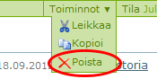

Ennen varsinaista poistoa piazza vielä kysyy käyttäjältä varmistuksen poistolle.

----

## Dokumenttien ja kansioiden muut tiedot 

**Muuokkaa** -tilassa on mahdollista antaa myös muita sisältöön liittyviä tietoja.

Ruudulla on viisi !''välilehden!'' -näköistä osioita, joista avautuu kyseiseen kansioon tai sisältöön liittyvää lisätietoa.

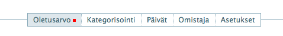

* __Kategorisointi__

	- Voidaan antaa sisällölle joitain avainsanoja, jotka ovat hyödyllisiä esim. haettaessa tietyntyyppisiä dokumentteja **Haku**-toiminnolla.
	- Sitä voidaan myös käyttää ns. älykansioissa hyödyksi, jolloin saadaan kaikki samantyyppiset dokumentit koottua !''loogiseen kansioon!'' vaikka ne fyysisesti olisivatkin hajallaan ympäri sisältörakennetta.

* __Päivät__

	- Voidaan antaa dokumentin julkaisemisen alkamis- ja päättymispäivät.
	- Tulee kyseeseen aika harvoin, mutta on mahdollista jos on joku tietyn ajan voimassa oleva dokumentti tai jos haluaa jukaista dokumentin tiettynä ajankohtana.

* __Omistaja__ - _tärkeä_

	- Täällä voidaan käydä vaihtamassa dokumentin omistaja- tai tekijä toiseksi.
	- Esim. tilanteessa jossa vastuu dokumentin tai kansion sisällöstä siirretään toiselle henkilölle, kts. [wiki:KansionTekeminen tekijän muuttaminen]

* __Asetukset__

	- Oletusarvona, että kommentointi sallittua.

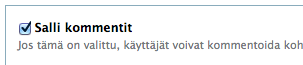

----

