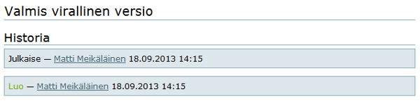

# Dokumenttien ylläpito

Tämän ohjesivun sisältö:

- Dokumenttien julkaiseminen
- Dokumentin hyväksyminen
- Hyväksytyn dokumentin päivittäminen
- Dokumentin historiatiedot

----

## Dokumentin julkaiseminen

Kun piazzalle tehdään tai tuodaan uusia dokumentteja, niiden tila on aluksi **julkinen luonnos**.

Terminä se tarkoittaa sitä, että dokumentti ei ole vielä valmis, se kuitenkin näkyy kaikille jäsenille.

Luettelossa sen värinä on vihreä.
Myös kansiot ovat aluksi luonnoksia.
Prosessikansiot luonnoksina (vihreinä) ovat usein merkkinä siitä, että prosessia ei ole vielä kehitetty.

Kansiot, kertaluonteiset ja säilytettävät dokumentit yleensä julkaistaan heti valitsemalla : 
Tila __julkinen luonnos__ -> __Julkaise__ , jolloin väri muuttuu siniseksi.

Näin toimitaan, jos ei ole muuta sovittu.

Sen sijaan ylläpidettävät dokumentit (prosessikaaviot, kuvaukset ja ohjeet) pidetään luonnoksena niin kauan, kunnes ne ovat valmiit hyväksyttäväksi.

----

## Dokumentin hyväksyminen

Kun dokumentti on valmis hyväksyttäväksi, dokumentin laatija valitsee : 
**Tila julkinen luonnos** -> **Lähetä julkaistavaksi**.

Dokumentin tilaksi tulee **Sisällön tarkistus kesken**.

Väri muuttuu oranssiksi ja dokumentti ilmestyy **Tarkastuslista** -välilehdelle, jossa näkyy kaikki hyväksyttävänä olevat dokumentit.
Hyväksyjä seuraa Tarkastuslistaa.

Jos dokumentti on **sivuna**, hyväksyjä pystyy lisäämään hyväksymismerkinnät suoraan sivulle valitsemalla __Muokkaa__.

Hyväksymisen jälkeen hyväksyjä muuttaa tilan julkiseksi valitsemalla : 
**Tila julkinen luonnos** -> **Julkaise**. 
Samalla dokumentti poistuu Tarkastuslistalta. 

Jos dokumenttia ei hyväksytä sellaisenaan, hyväksyjä lähettää sen takaisin valisemalla : 
**Lähetä takaisin** 
ja kommentoimalla dokumenttia. 
Dokumentin laatija tekee tarvittavat muutokset ja lähettää sen uudestaan hyväksyttäväksi.

Jos dokumentti on **tiedostona**, hyväksymismerkinnät tulee tehdä tekstinkäsittelyohjelmalla, eli 

* tiedosto tallennetaan koneelle
* täydennetään tiedot
* tuodaan takaisin piazzalle (muokkaa -> korvaa uudella tiedostolla).

Muistetaan tiedottaa uusista dokumenteista sovitun toimintatavan mukaisesti.

Toimintaohjeet kuitataan luetuksi. Tutustu dokumenttiin [Toimintaohjeet](toimintaohjeet).

----

## Hyväksytyn dokumentin päivittäminen

Sivudokumentit päivitetään suoraan piazzalla **Muokkaa**: muutetaan päivämäärä, tarvittaessa laatija, poistetaan hyväksymismerkinnät, muutetaan mahdollisen edellisen päivityksen fontit normaaleiksi, päivitetään tekstiä sovitulla fontilla.

Tiedostodokumenttien päivitys tehdään samalla tavalla kuin tiedoston muokkaaminen ja täydentäminen, kts. [Dokumenttien laatiminen](dokumentin_tekeminen).

Muutetaan päivämäärä, tarvittaessa laatija, poistetaan hyväksymismerkinnät, muutetaan mahdollisen edellisen päivityksen fontit normaaleiksi, päivitetään tekstiä sovitulla fontilla.

Ylläpidettävät dokumentit tulee aina hyväksyttää päivittämisen jälkeen. 
Dokumentti lähetetään hyväksyttäväksi muuttamalla **Tila julkaistu** -> **Lähetä takaisin**. 
Hyväksyminen tapahtuu edellä kuvatun mukaisesti.

Myös päivityksistä muistetaan tiedottaa ja toimintaohjeet kuitata sovitulla tavalla.

----

## Dokumentti yksityiseksi

Jos halutaan, että dokumentti ei näy muille, tilaksi valitaan **Tee yksityiseksi**, jolloin dokumentti näkyy vain tekijälle ja sivuston ylläpidolle. 

Yksityiseksi muuttaminen tehdään, kun tila on luonnos.

Tätä käytäntöä voi harrastaa hyvin keskeneräisille tai arkaluonteisille dokumenteille. 
Valmiit ylläpidettävät prosessidokumentithan ovat luettavissa kaikille käyttöoikeudet omaaville.

----

## Dokumenttien historiatiedot

Kaikilla dokumenteilla on linkki nimeltään Historia, jota voi klikata nähdäkseen dokumentin historian.

Historia kertoo miten dokumentin tila on vaihtunut, koska ja kuka sen on hyväksynyt. 
Siitä saattaa olla joskus hyvää apua jos tulee joku epäselvä tilanne. 
Erityisesti Piazzalla laadittujen tekstidokumenttien muutokset saa tarkasti esille..

----
