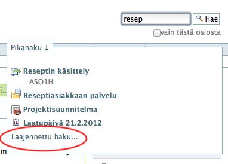
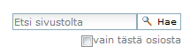
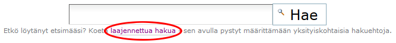
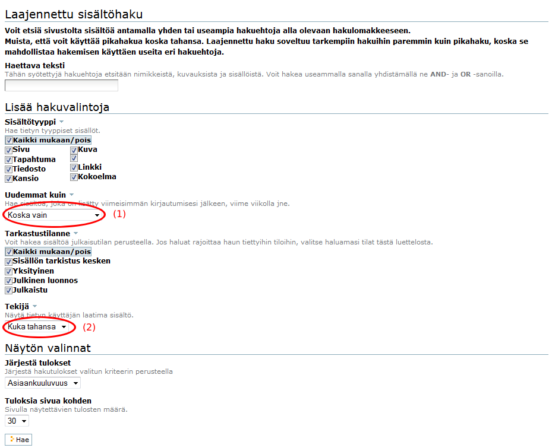
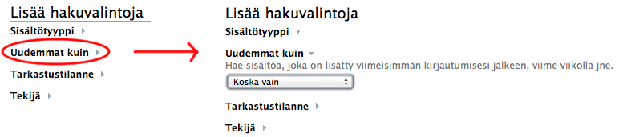
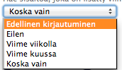
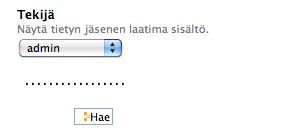

# Hakutoiminnot

## Pikahaku

Kun dokumentteja on paljon, niin haun merkitys korostuu ja sitä kannattaa myös käyttää.

Haku toimii ___online-hakuna___, eli ohjelma hakee sopivia sivuja sitä mukaa kuin kenttään kirjoitetaan sanan alkuosaa.

Yhdellä kirjaimella se ei vielä ala hakea mitään, mutta jos kirjoittaa lisää hakusanaa, niin ohjelma etsii sopivia ehdokkaita sivujen joukosta ja näyttää niitä koko ajan pienessä ikkunassa (pikahaku).

Piazza löytää sivudokumenttina laaditun tekstin sisällön perusteella hakusanaa vastaavat.

Sen sijaan piazza ei pysty etsimään liitetiedostojen sisältä hakusanoja, vaan niistä se etsii vain otsikoista ja lyhyestä kuvauksesta.
Tämän takia on tärkeää kuvata tekemänsä dokumentin otsikko ja lyhyt kuvaus oikein, vaikka itse asia olisikin liitetiedostossa (word,excel,tms).

Yleensä pikahaku löytää aika hyvin halutun dokumentin, mutta sen lisäksi voi kokeilla laajennettua hakua.
Jos serveri on pahasti kuormittunut tai linjayhteys hidastelee, niin pikahakua joutuu ehkä odottelemaan hieman, mutta yleensä se etsii melkein reaaliajassa. Kärsivällisyys kannattaa tässäkin tilanteessa kuten myös muuallakin ruuhka-aikoina.

----

## Laajennettu haku

Laajennettu haku on tehokas tapa etsiä tietoja useilla erilaisilla tekijöillä, esim. ajan, sisältötyypin ja tarkastustilanteen mukaan.

Myös __halutun käyttäjän__ kaikki dokumentit voidaan helposti etsiä tätä kautta esiin

* (esim. tilanne jossa henkilö lähtee talosta ja hänen tekemänsä dokumentit halutaan hallitusti siirtää uusille prosessinomistajille tms).

Laajennettu haku voidaan ottaa esiin normaalin haun alareunasta : 
(kts. yo. ruutumalli  -> Laajennettu haku .... )

tai vaihtoehtoisesti niin että painetaan pelkkää   **Hae -toiminto** ilman mitään hakusanaa 
(kts. ruutumalli alla).

Tällöin ohjelma antaa ruudun jolla ei ole mitään hakutuloksia ''(Hakutulokset — 0 items matching your search terms )'',
mutta tästä ruudusta löytyy linkki **Koeta laajennettua hakua**.

Se avaa uuden ruudun  jossa voidaan antaa enemmän hakuvaihtoehtoja.
Linkki on hieman hämäävässä paikassa mutta sitä klikkaamalla päästään eteenpäin.

----

Laajennetun haun hakutekijät näkyy seuraavassa ruutumallissa :

Huomaa, että **Lisää hakuvalintoja** -kohdan valinnat saa auki klikkaamalla valinnan otsikkoa:

Laajennettua hakua voi kokeilla erilaisilla hakuehdoilla tai niiden yhdistelmillä.

Seuraavassa joitakin mahdollisia hakutapoja :

** (1) **
Haetaan ajan perusteella; vaihtoehtoina on ''Edellinen kirjautuminen, Eilen, Viime viikolla tai Viime kuussa''. 
Edellinen kirjautuminen tarkoittaa käyttäjän itsensä edellisen käynnin jälkeen tulleita dokumentteja.

** (2) **
Haetaan tietyn tekijän kaikki dokumentit

Tekijän haussa valitaan haluttu käyttäjä luttelosta joka avautuu klikkaamalla ao.painiketta.

----
