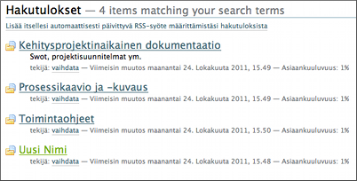
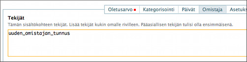

# Talosta poistuneet henkilöt (käytännöt)

* tämä ohje koskee pääsääntöisesti vain Sivuston ylläpitäjä-roolissa olevia.

## Taustaa

Piazzassa jokaisella dokumentilla on aina omistaja ja myös tekijä.

Omistaja ja tekijä ovat Piazzan käytön kannalta sama asia.
Se joka alunperin on dokumentin lisännyt, hänestä tulee myös sen omistaja, mutta tämä tieto voidaan tarvittaessa muuttaa jälkikäteen.
Käytännössä prosessinomistajat ovat usein oman alueensa dokumenttien omistajia.

Ohjelmistossa “omistaja”-tietoa käytetään hyväksi monessa kohtaa, ja sen takia se on tärkeä asia.

Aikaisemmin kun henkilö lähti talosta, niin hänen omistamansa sivut/dokumentit tuli siirtää jollekulle toiselle, jotta niiden muokkaaminen oli edelleen mahdollista.

Nykyisessä ohjelmistoversiossa tämä ei ole enää tarpeellista, sillä jokainen Editori-roolin käyttäjä voi muokata toisen henkilön tuottamia dokumentteja ja sivuja.

<pre style="border:1px solid #CCC; padding: 10px; background: #EEE;">
Normaalitilanteessa henkilö voidaan poistaa kokonaan mikäli hän lähtee talosta.
</pre>

Tarvittaessa henkilön tunnus/nimi voidaan toki jättää käyttäjäluetteloon, 
ja jos __poistetaan kaikki "ruksitukset"__ niin hän ei enää pääse kirjautumaan järjestelmään.

Eli tietoturvan ja tietosuojan kannalta on riittävä toimenpide __poistaa__ ruksitukset eli __kaikki oikeudet__.

Poistetun henkilön tekemät kommentit jäävät jokaisen dokumentin yhteyteen kaikissa tapauksissa.

Dokumentin omistaja ja tekijä voidaan kuitenkin edelleen tarvittaessa siirtää toiselle käyttäjälle.

Yhteenvetona voidaan sanoa että on jokaisen apteekin omassa harkinnassa kumpaa poistotapaa haluaa käyttää.
Ts. kokonaan poistaminen vs. oikeuksien poistaminen. 

## Siirtäminen dokumentti kerrallaan

Tämä tulee kyseeseen jos talosta lähteneen dokumentit !''hajotetaan!'' eri ihmisille, tai ei ole yhtä korvaavaa joka ottaisi dokumentit hallintaansa.

Ennen henkilön poistamista voidaan etsiä henkilön **kaikki omistukset**  Laajennetun haun avulla. 
Laajennetusta hausta on lisää tietoa [tässä ohjeessa](hakutoiminnot).

Laajennetulla haulla saadaan haettua lista henkilön kaikista dokumenteista ja kansioista, joka voisi olla esimerkiksi seuraavan ruutumallin mukainen :

Tätä saatua listaa läpikäymällä päästään siirtymään aina kyseiseen sisältöön, jossa **Muokkaa** -toiminnolla käydään korjaamassa **Omistaja** -tiedoissa oleva **tekijä** -tieto toisella tunnuksella.

Tekijät-laatikossa korvataan siis poistettava tunnus jollakin toisella tunnuksella.

Jos tekijöitä on useita, niin ne laitetaan eri riveille.

----

## Siirtäminen poistamisen yhteydessä

Käyttäjien oikeuksien siirtäminen toiselle käyttäjälle ei ole enää tarpeellista sen takia, että Editori-roolin käyttäjät pystyvät muokkaamaan myös poistettujen käyttäjien dokumentteja.

Jos jostain syystä kuitenkin halutaan, että poistetun käyttäjän dokumentit siirretään uudelle käyttäjälle ja dokumentteja on paljon, niin Piazzan tuesta `tuki@piazzaonward.fi` voi pyytää tämän operaation suorittamista. 

----
