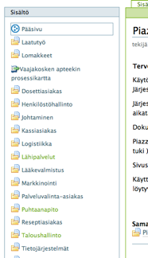
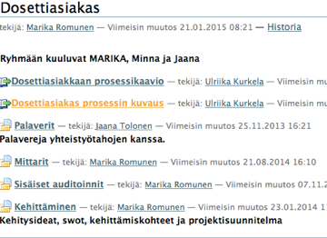
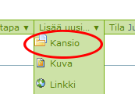
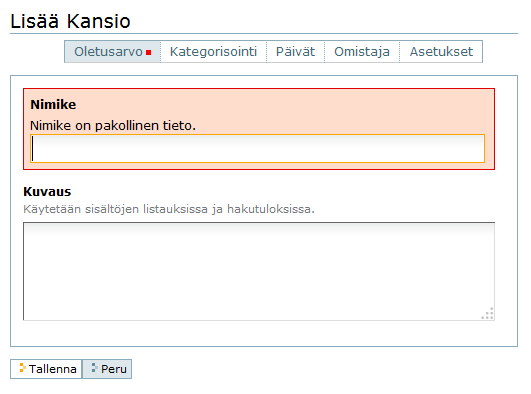
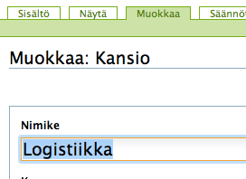
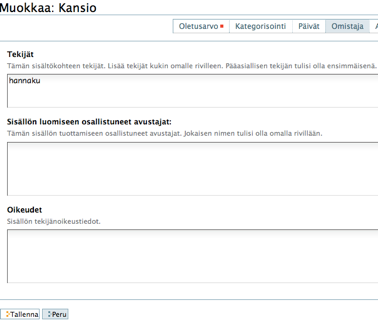
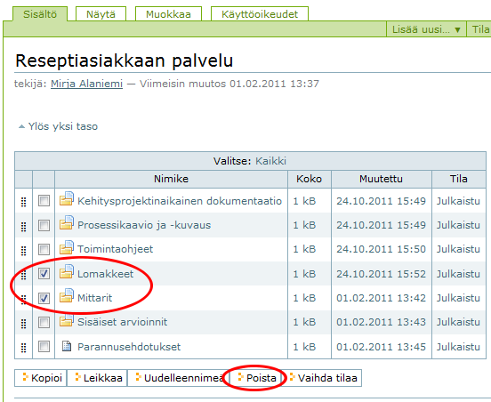
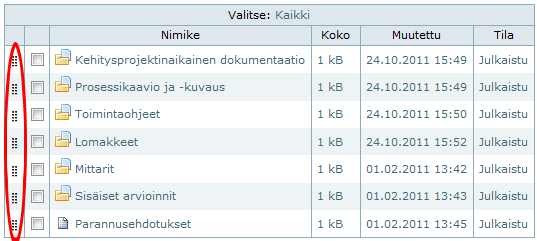
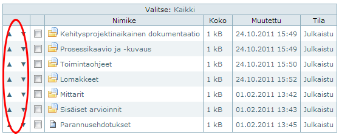

# Kansioiden ylläpito

Tässä ohjesivulla: 

- Piazzan kansiorakenne 
- Uuden kansion tekeminen 
- Kansion tekijän muuttaminen
- Kansion poisto, kopiointi ja siirtäminen
- Kansioiden sisällön uudelleen järjestämisen.

Piazzalla on valmiina prosessien mukainen kansiorakenne. Tässä esimerkki:

Prosessikansiot sisältävät yleensä alikansioita seuraavasti:

Prosessikaavio ja -kuvaus ovat yleensä suoraan prosessikansion alla. 
Prosessiryhmä voidaan kirjoittaa näkyville prosessikansion kuvaukseen.

----

## Uuden kansion tekeminen

Piazzalle voi tehdä uusia kansioita ja niille alakansioita jne.

Jos uusi kansio halutaan tehdä pääsivulle, valitaan pääsivulla vihreästä valikosta __Lisää uusi -> kansio__.

Jos uusi (ali)kansio halutaan jonkin kansion alle, avataan ko. kansio ja valitaan __Lisää uusi -> kansio__:

Tämä on hyvin samanlainen kuin kansioiden ja hakemistojen järjestäminen kaikissa tietokoneissa, esim. Windowsin kansiorakenne.

Lisäpiirteenä kansioille voidaan antaa nimikkeen lisäksi lyhyt kuvaus kansion sisällöstä. 
Sitä kannattaa käyttää, niin uusillekin tekijöille tulee hyvin ilmi kansioiden järjestelyn periaatteet eikä niin helposti mene asioita vääriin kansioihin, joista niiden hakeminen on joskus turhaa ajankäyttöä.

----

## Kansion julkaiseminen

Kansiot julkaistaan samalla tavalla kuin [dokumentit julkaistaan](dokumentin_yllapito/#dokumentin-julkaiseminen) :

- Valitse vihreästä valikosta Tila julknen luonnos
- Muuta tila **Julkaise**

Kansiot julkaistaan heti tai sen jälkeen, kun prosessikehittäminen on alkanut tai kun kehittäminen on valmis apteekin käytännön mukaisesti.

----

## Kansion tekijän muuttaminen

Kansion tekijänä on se henkilö, joka on alunperin tehnyt kansion. 
Tekijä muutetaan valitsemalla vihreästä valikosta **Muokkaa**. 

Valitaan avautuvalta sivulta **Tekijätiedot**. 
Muutetaan tekijäksi **omat tunnukset** ja lopuksi **tallenna**. 
Näin muutetaan tarvittaessa myös **dokumentin tekijä.** 

----

## Kansion poisto, kopiointi ja siirtäminen

Kansiot voidaan poistaa silloin kun ollaan sopivassa kohtaa kansiohierarkiassa.

Ylempänä olevasta vihreästä toimintopalkista valitaan **Sisältö** -näkymä, jossa näkyy kyseisen hakemiston tai alihakemiston rakenne luettelona. 

Tässä näkymässä on myös mahdollista ruksata tietty kansio (tai useita) ja sen jälkeen alhaalta löytyvällä **Poista** -panikkeella lähtevät kansiot pois.

Tässä samassa näkymässä voidaan myös nimetä kansiot uudelleen, sekä kopioida ja siirtää kansioita toiseen paikkaan (esim. pohjaksi jollekin muulle toiminnolle). 

----

## Kansion sisällön järjestäminen uudelleen

Kun Piazzalle lisätään uusia dokumentteja tai kansioita, ne tulevat alimmaksi, mikä ei aina hyvä paikka.
Kansion sisältö voidaan järjestää helposti haluttuun järjestykseen.

Järjestäminen onnistuu valitsemalla vihreän toimintopalkin välilehti **Sisältö**.
Se näyttää kansion tiivistettynä jokainen alikansio tai tiedosto omana rivinään.

Internet Explorerissa ja Firefoxissa järjestäminen onnistuu kun vedetään haluttu kansio hiirellä ylös- tai alaspäin rivin vasemmasta reunasta. 

Chromessa järjestäminen toimii rivin vasemmassa reunassa olevilla pienillä nuolinäppäimillä, josta klikkaamalla rivi siirtyy joko ylös tai alaspäin. Muut rivit järjestyvät sen mukaan automaattisesti.

Tällä tavalla käydään kaikki rivit niin että lopputulos on halutun näköinen. 
Sivua ei talleteta tässä tapauksessa sen kummemmin, vaan uusi järjestys näkyy samantien kaikille käyttäjille.

Jos siirrät alikansioita uuteen paikkaan, niin myös niiden sisältö seuraa mukana, joten sisältöä voi järjestää vapaasti semmoiseksi kuin haluaa.

----

