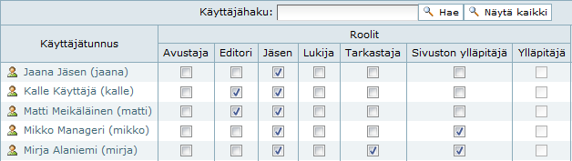
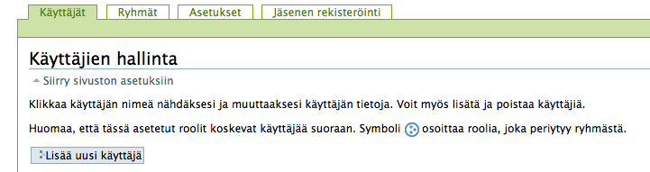
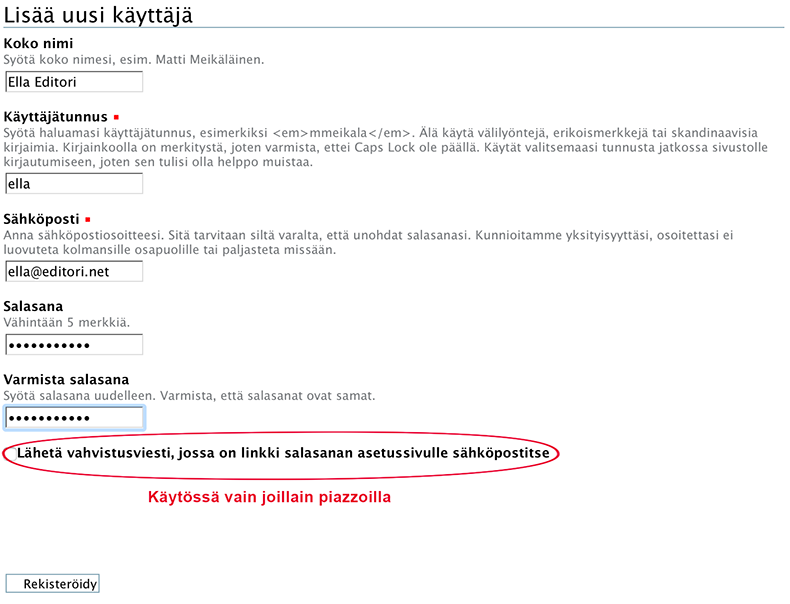
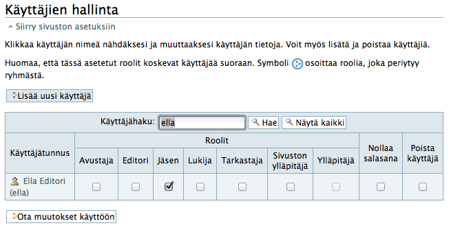
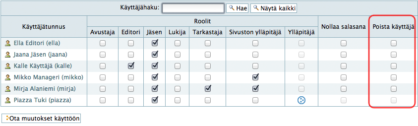

# Käyttäjien hallinta ja roolit

Piazzassa jokainen käyttäjä voi olla kolmessa roolissa, joiden periaate on seuraava :

* __Jäsen__
 
	- Kaikilla __jäsenillä__ on oikeus nähdä ja tarvittaessa muuttaa kaikkia dokumentteja
	- (poikkeuksena yksityiset dokumentit)''
	- Vaikka jäsenet pystyvät myös julkaisemaan kansioita ja dokumentteja, toimitaan apteekin käytännön mukaisesti.

* __Editori__

	- Editorilla on oikeus muuttaa kaikkea sivuston sisältöä, myös poistettujen käyttäjien luomia dokumentteja ja sivuja.

* __Tarkastaja, Avustaja ja Lukija__

	- Näillä rooleilla ei ole toistaiseksi merkitystä Piazzassa eikä niitä käytetä.

* __Sivuston ylläpitäjä__

	- Voi tehdä sivuston ylläpitoon kuuluvia asioita, kuten luoda ja poistaa uusia käyttäjiä ja muuttaa käyttäjien oikeuksia.
	- Sivuston ylläpitäjä voi poistaa kommentit.
	- Jokaisella apteekilla on yksi tai useampi sivuston ylläpitäjä.

* __Ylläpitäjä (entinen manageri)__

	- Voi tehdä kaikkia sivuston ylläpitoon liittyviä asioita.
	- Ylläpitäjä-roolia ei enää käytetä, vaan aikaisemmassa versiossa vastaavat manageri-roolin käyttäjät on siirretty Sivuston ylläpitäjät -rooliin.

----

## Käyttäjien lisääminen

Sivuston ylläpitäjät voivat lisätä käyttäjiä valitsemalla ruudun oikeasta yläkulmasta **Sivuston asetukset**
ja avautuvalta sivulta kohdan **Käyttäjät ja ryhmät**, josta pääsee käyttäjien hallintaan:

Käyttäjä lisätään klikkaamalla **Lisää käyttäjä** -nappulaa, jolloin aukeaa seuraavanlainen lomake:

Lisää käyttäjän nimi, tunnus, sähköposti ja tilapäinen salasana, joka käyttäjän tulee muuttaa kirjautuessaan ensimmäistä kertaa sivustolle
[kts. Oman salasanan vaihtaminen](salasanan_vaihto)

Tämän jälkeen klikkaa **Rekisteröidy** -nappulaa.

Osalla sivustoista on näkyvissä **Lähetä vahvistusviesti, jossa on linkki salasanan asetussivulle sähköpostitse** -toiminnallisuus. Ruksaamalla tämän lisätty käyttäjä saa sähköpostiinsa viestin, jonka kautta voi vahvistaa rekisteröitymisen ja vaihtaa salasanan. Jos käyttäjällä ei ole sähköpostia, älä ruksaa tätä valintaa.

Kun käyttäjä on rekisteröity, avautuu Käyttäjien hallinta -sivu, jossa on näkyvillä vain juuri rekisteröity käyttäjä. Tässä kohtaa voit tarvittaessa lisätä käyttäjälle Editori ja Tarkastaja -roolit. Sivuston ylläpitäjä -rooli kannattaa antaa vain sellaisille käyttäjille, jotka sitä todella tarvitsevat. Kun oikeat roolit on ruksattu, otetaan ne käyttöön klikkaamalla **Ota muutokset käyttöön** -nappulaa.

----

## Käyttäjien poistaminen

Käyttäjä poistetaan ruksaamalla käyttäjä **Käyttäjien hallinta** -sivulla kohdassa **Poista käyttäjä** ja klikkaamlla **Ota muutokset käyttöön** -nappulaa. 

----
