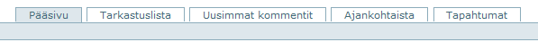

## Navigointi-ikkuna

Piazza-ruuduilla liikutaan useallakin tavalla, mutta tärkein navigointitoiminto on ruudun vasemmassa reunassa oleva ikkuna, joka on otsikoitu Sisältö. 

Sen avulla päästään kansiorakenteessa siihen osaan järjestelmää, johon halutaan.

----

## Uusimmat muutokset

Oikealla puolella käyttöliittymää löytyy ikkuna **Uusimmat muutokset**. 

	

Se kertoo mihin dokumentteihin on viimeksi koskettu, ja on hyvä apuväline niille jotka seuraavat sivuston asioita tiiviisti.

Sen avulla pääsee aina tuoreimpiin asioihin kiinni.

Uusimmat muutokset -ikkunan alareunassa on vielä linkki, jolla päästään selaamaan vanhempiakin muutoksia kuin ikkunaan mahtuu.

Se avaa oman ruudun jossa muuttunut sisältö on aikajärjestyksessä, uusimmat alussa.

----

## Yläreunan välilehdet

Käyttöliittymän yläreunassa on muutama välilehti, joiden takaa löytyy myös hyödyllisiä asioita.

* __Tarkastuslista__

	- Tarkastuslistasta löytyy kaikki ne dokumentit, joille on pyydetty hyväksymistä.
	- Lue ohjeet [Dokumenttien hyväksyminen](dokumentin_yllapito/#dokumentin-hyvaksyminen) ja [Käyttäjien roolit](kayttajien_roolit).

* __Uusimmat kommentit__

	- Piazzassa on kommentointimahdollisuus jokaiselle dokumentille.
	- Se on myös hyödyllinen ominaisuus, jota kannattaa käyttää ahkerasti.
	- Tämä välilehti kerää kaikki kommentit omaksi listakseen, josta pääsee linkillä tarkemmin kyseiseen dokumenttiin (ja kommentteihin).

* __Ajankohtaista__

	- Onwardin tai muidenkin ryhmän jäsenten lähettämät tiedotteet. 

* __Tapahtumat__

	- Tulevien valmennusten tai koulutusten ohjelmia, jota yleensä ylläpitää Onward.
	- Tapahtumia voi käyttää myös kokousten yms. asialistana ja ohjelmana.

----

## Sähköpostin lähettäminen ja näkymän tulostaminen

Piazzalta voi lähettää sähköposteja klikkaamalla kirjekuorta.

Kirjoita avautuvaan näkymään :

- vastaanottajan sähköpostiosoite
- kommenttikenttään viestisi
- ja lopuksi __lähetä__.

Jos ei ole omaa apteekin sähköpostia, viestiin kannattaa kirjoittaa viestin lähettäjä.

Lähetetty viesti saapuu vastaanottajalle niin, että lähettäjänä ikäänkuin Pizzatuki.
Viestin otsikkona on aihe (kansio, dokumentti), josta viesti on lähetetty.

Viestissä on linkkeinä piazzan osoite, lähettäjän sähköpostiosoite ja vielä osoite ko. asiaan.
Pääset linkkien kautta suoraan asiaan. 

__Huom. jos haluat lähettää viestin lähettäjälle, klikkaa viestistä lähettäjän osoitetta.__ 
Älä vastaa viestiin, koska viesti menee silloin piazzatukeen.

Suosittelen käyttämään piazza-asioissa tätä viestittelyä, on nopeampaa ja vastaanottajalle helpompaa.
Etenkin, jos haluat, että vastaanottaja reagoi ko. asiaan mahdollisimman nopeasti.

Tulostaminen onnistuu klikkaamalla kirjekuoren vieressä olevaan tulostinta.
Sekä kirjekuori että printteri löytyvät jokaiselta sivulta oikealta alakulmasta.

----
