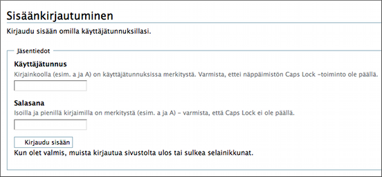

# Piazzan osoite

Piazzan osoite on muotoa:
<code style="font-size:90%;">
  http://piazzaonward.fi/...apteekinnimi
</code>

	
Tallenna osoite suosikkeihin tai kirjainmerkkeihin esim. nimelle __Piazza__.

----

## Kirjautuminen Piazzalle

Piazzalle pääsee sisään vain __käyttäjätunnuksilla.__ 
	Piazza on siten suljettu ulkopuolisilta.

Käyttäjätunnukset saa sivuston ylläpitäjä -roolissa olevilta henkilöiltä.

Kirjautumisruutu näyttää seuraavanlaiselta.

Huomaa että __isoilla ja pienillä kirjaimilla on ero__, joten CapsLock -näppäimen jäädessä vahingossa päälle saattaa tulla ongelmia kirjauduttaessa.

Piazzalle mennessäsi kirjaudu aina __omilla tunnuksillasi__, jolloin nimesi tulee tekijäksi kommentteihin ja uusiin dokumentteihin ja kansioihin.

Piazzalta poistuessasi kirjaudu ulos sinisestä valikosta oikealla ylhäällä **Poistu**.

----

## Oman salasanan ja sivueditorin vaihtaminen

Salasana kannattaa ja sivueditorin tulee vaihtaa sen jälkeen, kun on saanut tunnukset ja kirjautunut ensimmäisen kerran sisälle.

Salasanan vaihtamisesta löytyy tietoa [täältä](salasanan_vaihto).

Sivueditorin vaihtamisesta löytyy tietoa [täältä](sivueditorit.md).

TinyMCE-editorilla pääset vastaamaan kommentteihin, vastaamista tarvitaan ainakin toimintaohjeiden lukukuittauksissa
[Toimintaohjeista tietoa täällä](toimintaohjeet).

----
