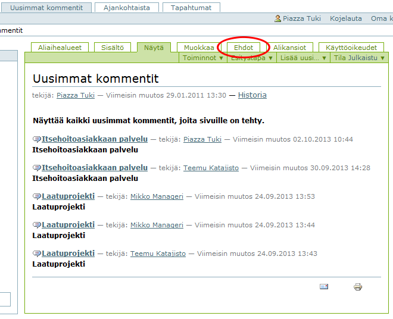
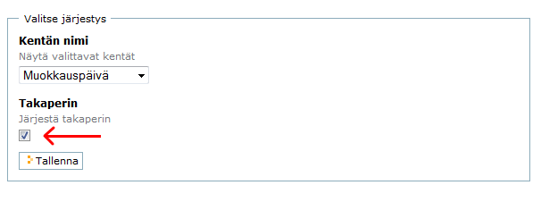

# Uusimmat kommentit -järjestys

Uusimmat kommentit -välilehden (kuten myös muiden välilehtien) sisällön järjestyksen voi määrittää Ehdot-välilehdeltä.

Ehdot -välilehden alaosassa on **Valitse järjestys** -kohta, jossa on kentän nimi, jonka perusteella järjestys määräytyy sekä mahdollisuus valita kumminko päin sisältö järjestetään valitun kentän mukaan.

Esimerkiksi jos kentän nimi on muokkauspäivä, niin ruksaamalla **Takaperin** tulee uusin kommentti ylimmäiseksi, ja vanhin kommentti alimmaiseksi.

Vastaavasti jos kohdassa ei ole ruksia, niin järjestys on päinvastainen.

----

Kansioiden kohdalla ei samanlaista Ehdot-välilehteä ole käytettävissä, vaan kansiot on järjestettävä tarvittaessa käsin Sisältö-välilehden kautta
(kts. [Kansion sisällön järjestäminen uudelleen](kansiot/#kansion-sisallon-jarjestaminen-uudelleen).

----
