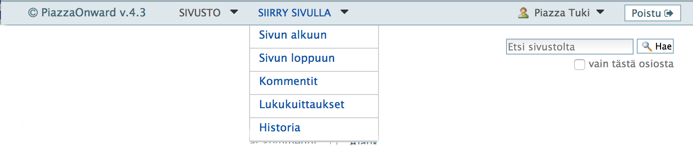
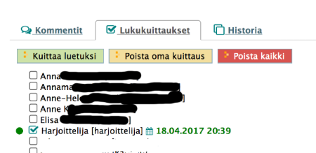
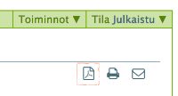
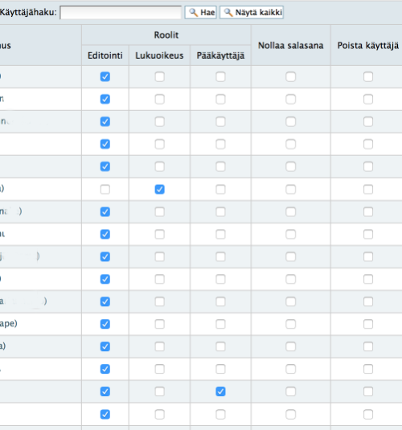

# Piazzan ohjelmistoversio 4.3

!!! note "18.4.2017 [Netmiller, Esa Laitila]"
	Piazzan takana olevan Plone-ohjelmiston versio päivitetään kevään 2017 aikana
	pari pykälää ylemmäksi, ja sillä saamme myös kehitystä varten hieman enemmän eväitä
	joilla voidaan jatkossa paremmin tehdä varsinaista käyttäjille näkyvää kehittämistä.

----

Seuraavassa hieman ohjeistusta mitkä asiat tulevat muuttumaan  :

* __Yläpalkki__

	- varsinkin pidempien dokumenttien kohdalla on ollut pieni ongelma se että joutuu _"rullaamaan"_ sivua aika pitkälle että pääsee esim. alareunassa oleviin kommentteihin käsiksi
	- nyt __kaikkien sivujen ylälaitaan__ on otettu kiinteä toimintopalkki joka ei liiku sivun scrollauksen mukana
	- siinä on muutamia käyttöä helpottavia uusi toimintoja + osa vanhoistakin toiminnoista on siirretty tähän toimintopalkkiin asioiden selkeyttämiseksi
    - ohessa kuvamalli 

    

----

* __Kommentit__

	- kommentit on koodattu kokonaan uusiksi, mutta vanha toiminnallisuus on otettu pohjaksi
    - myös vanhat kommentit siirtyvät "yliheitossa" mukaan uuteen
    - muutoksena aikaisempaan kommentit järjestetään niin että uusin tulee ylimmäksi kun vanhassa uusin meni aina alimmaiseksi
    - näin tehdään __ensimmäisen tason kommenteille__, mutta vastaukset tiettyyn kommenttiin (=kommentti-vastaus-ketju) säilyy kronologisesti kuten ennenkin
    - kommentit löytyvät jokaisen sivun alareunasta, joskin yläpalkissa on __pikatoiminto__ jolla niihin pääsee nopeammin

----

* __Lukukuittaukset__

    - lukukuittauksille on oma välilehti sivun alareunassa, jossa jokainen voi kuitata dokumentin luetuksi tai poistaa oman lukukuittauksen
    - ylläpitäjä-oikeuksilla pystyy myös poistamaan kaikki lukukuittaukset, kun dokumenttia päivitetään ja kaikkien on luettava ja kuitattava päivitetty versio
    - myös lukukuittauksiin pääsee yläpalkin __pikatoiminnolla__ nopeammin

    

----

* __Vanhojen lukukuittaukset siirto__

    - vanhoja lukukuittauksia ei pystytä siirtämään ohjelmallisesti uuteen systeemiin, koska ne ovat varsinaisten kommenttien joukossa tekstimuodossa
    - uudessa ohjelmaversiossa ehdotus on, että jokainen käy ruksaamassa omat lukukuittauksensa uudelleen __(Lukukuittaukset-välilehden kautta)__
    - sen jälkeen hän voi myös poistaa oman kommenttipohjaisen kuittauksensa
    - tässä on hieman käsityötä, mutta kun tämä on saatu korjattua, niin jatko menee selkeämmin koska lukukuittaukset ovat erillään "oikeista" kommenteista

----

* __Historia-näkymä__

	- vanha historia-näkymä on säilynyt ennallaan, mutta se on siirretty vaan sellaisenaan sivun alareunaan omalle välilehdelleen
	- ja myös sille on yläpalkissa __pikatoiminto__

----

* __Tulostustoiminnot__

	- sivu/dokumenttikohtaisiin toimintoihin on lisätty uusi toiminto, jolla voi tulostaa sivun __pdf-muotoon__
	- se on kätevämpi monessa asiassa, ja toimii myös paremmin jos tulostaa sen paperille
    - __office-dokumentteja__ (Word-, Excel-, PowerPoint-tiedostoja) ei voi toistaiseksi tulostaa pdf-muotoon elleivät ne ole jo valmiiksi siinä muodossa
    - mutta tämä ominaisuus on työlistalla ja toivottavasti saadaan jatkossa toteutettua

    

----

* __Käyttöoikeudet__

	- käyttöoikeuksia (Sivuston käyttäjät) on hieman yksinkertaistettu ja selkeytetty
    - tällä hetkellä käyttöoikeuksia on vain kolme:
        - __Editointi__
        - __Lukuoikeus__
        - __Pääkäyttäjä__
    - normaalisti kaikilla on __Editointioikeudet__, ja tarvittaessa pelkkä lukuoikeus  
    (esim. auditoijat tms)
    - pääkäyttäjäoikeudet määritellään tarpeen mukaan

    

----

* __Taulukot sivudokumenteissa__

    - mikäli sivudokumenteissa on käytetty taulukkoja, niin niiden leveys on nyt 100%
    - eli ne täyttävät koko tilan horisontaalisesti, mikä selkeyttää hieman ulkoasua
    - sivudokumenttien laatimiseen/editointiin tullaan jatkossa tekemään lisää kehitystä

----
