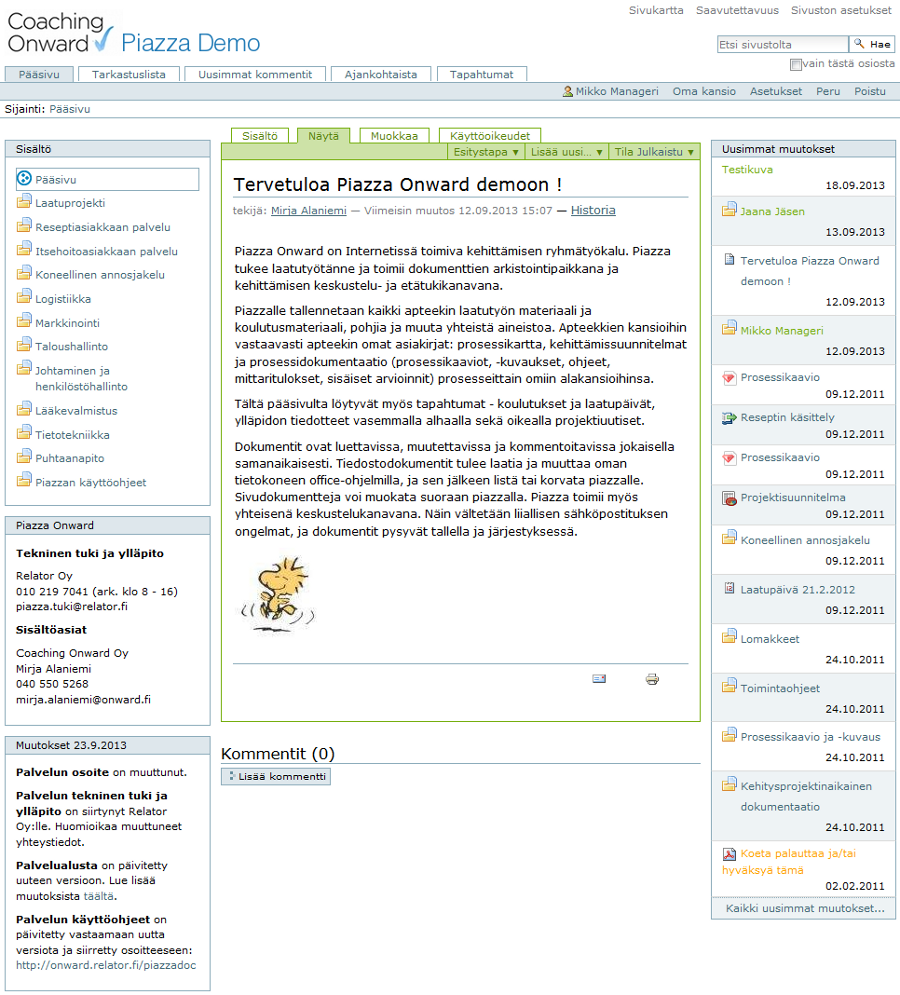

# Mikä on Piazza-dokumentointi

Piazza-dokumentointi on verkossa toimiva dokumenttien hallintajärjestelmä.

Piazzaa käytetään dokumenttien sähköiseen arkistointiin sekä tiedotus-, kommentointi- ja keskustelujärjestelmänä.

Lisäksi Piazzaa hyödynnetään vuorovaikutteisena ympäristönä.

Piazzan avulla dokumentit pysyvät järjestyksessä ja niiden hallinta on helpompaa. Piazza pitää myös kirjaa dokumentteihin tehdyistä muutoksista, joka helpottaa myös niiden pitämisessä ajan tasalla. Piazzalla on aina viimeisin versio, jolloin sama tieto on käytettävissä kaikilla, myös sivuapteekilla. 

Tärkeää, että tiedostodokumentteja päivitettäessä piazzalle nostetaan aina uusin versio.
Sivudokumenttien  viimeisin versio on luonnostaan piazzalla, koska sivueditointi tehdään suoraan piazzalle.
Lue lisää [dokumentin laatimisesta](dokumentin_tekeminen.md).

Jokainen voi vaikuttaa dokumentteihin tai toimintaan kommentoimalla dokumentteja.

Dokumentit voi hyväksyttää piazzalla sähköisesti, myös toimintaohjeet ja muut sovitut [lukukuittauksella](toimintaohjeet.md/#toimintaohjeiden-kuittaaminen).

Piazzan tunnukset voi antaa määräajaksi esim. sertifioijalle, jolloin dokumentteja ei tarvitse lähettää sähköpostilla tai muistitikulla.

----

## Ruutumalli

----

## Piazzan käyttö

Piazzassa sisällön ja sivujen ylläpito tapahtuu nettiselaimen avulla, joten se ei tarvitse mitään erillistä ohjelmaa toimiakseen.

Piazzan käyttöön riittää, kun on käytettävissä tavanomainen www-selain, esim. Firefox, Chrome, Edge, Internet Explorer, Safari, Opera.

Ohjeita [kirjautumiseen piazzalle](kirjautuminen).

----

© 2016 Coaching Onward Oy

----

