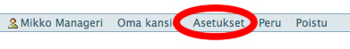
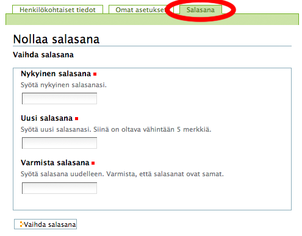

# Oman salasanan vaihtaminen

Oman salasanan vaihto tapahtuu seuraavasti

(1) valitse oikeasta ylänurkasta löytyvä toiminto :

__Asetukset__

(2) Valitse sivun valikosta __Salasana__, jolloin palvelu kysyy vanhaa salasanaa ja pyytää antamaan uuden + vahvistamaan sen toisessa kentässä

----

## Unohtunut salasana

Unohtuneen salasanan nollausta voi pyytää sähköpostilla Piazzan tuesta:

	admin@netmiller.fi

----
