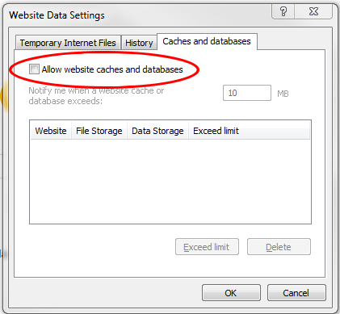

# Selainten välimuistiasetuksista

## Palvelimen välimuistin toiminta

Piazzan palvelin käyttää välimuistia nopeuttamaan pysyvien tietojen (logojen, tyylitiedostojen yms.) hakemista palvelimelta Piazzaa käytettäessä.

Palvelimen välimuistiasetukset on tehty siten, että muuttuvia tietoja (dokumentit, sivujen sisältö, kuvat, yms.) ei palauteta välimuistista vaan ne haetaan aina palvelimen tietokannasta, jotta käyttäjälle palautetaan aina uusin versio tiedoista.

----

## Selainten välimuistin toiminta

Selaimen asetuksista voidaan asettaa selain käyttämään omaa välimuistia, jolloin tietoja ei haeta palvelimelta,
jos selain tulkitsee, että tiedot eivät ole muuttuneet.

Tämä toiminnallisuus ei kuitenkaan aina toimi oikein, jolloin selain voi palauttaa vanhemman version tiedoista omasta välimuististaan
vaikka tiedot olisivatkin päivittyneet palvelimelle.

Ongelmallisia selaimia ovat ainakin Internet Explorerin eri versiot, sekä mahdollisesti ohjelmat, jotka käyttävät sisäänrakennettua Internet Explorer -selainta, kuten Pharmadatan Presto.

----

## Miten toimia jos tiedostosta palautuu vanha versio 

### InternetExplorer

Jos tallensit uuden version tiedostosta Piazzaan, ja sen avattuasi näkyy edelleen vanha versio, niin älä muuta ja tallenna tiedostoa uudelleen, sillä uusin tiedosto on kyllä tallennettu palvelimelle, mutta selaimesi palauttaa sinulle vanhan version. Voit korjata ongelman tekemällä seuraavat toimenpiteet:

1. Tarkasta selaimesi välimuistiasetukset. Internet Explorerissa (myös Prestossa) tämä tapahtuu menemällä selaimen asetuksiin ja sieltä '''Internet asetukset''' (tai Käynnistävalikon Ohjauspaneelin kautta '''Verkko ja Internet''' -> '''Internet asetukset''') ja valitsemalla '''Yleiset''' -välilehden. Välilehden alaosasta löytyy '''Asetukset'''-nappula '''Selaushistorian''' alta, jota painamalla pääsee muuttamaan selaimen välimuistiasetuksia.
  * '''Väliaikaiset Internet-tiedostot''' -välilehdellä pitäisi olla täppä kohdassa '''Joka kerta kun käyn sivulla''' tai '''Automaattisesti''' kohdassa. Jos '''Automaattisesti''' ei tunnu aina toimivan oikein, niin silloin turvallisin valinta on '''Joka kerta kun käyn sivulla'''.
  * '''Välimuisti ja tietokannat''' -välilehdellä ei saa olla täppää kohdassa '''Salli sivustojen välimuisti ja tietokannat'''

2. Jos asetusten muuttamisesta huolimatta selain edelleen palauttaa vanhan version, niin voit tyhjentää selaimen välimuistin pitämällä Ctrl-näppäintä pohjassa ja painamalla F5-näppäintä, jolloin selain lataa sivun uudelleen palvelimelta. 
  * Prestossa paina hiiren oikeanpuoleista näppäintä ja valitse avautuvasta valikosta '''Päivitä'''.

Alla vielä kuvat asetuksista englanninkielisessä Internet Explorerissa.

___Internet-asetukset___

----

___Väliaikaiset Internet-tiedostot___

----

___Välimuisti ja tietokannat___

----

### Mozilla Firefox

Mene Firefoxin asetuksiin ja avaa 

* (1) Valikko oikeasta yläreunasta ja valitse sieltä
* (2) Asetukset

----

Sen jälkeen 

* (1) Valitse vasemmanpuoleisesta valikosta Lisäasetukset ja sen jälkeen
* (2) Valitse sivun yläreunasta Verkko
* Tämän jälkeen (3) klikkaa Välimuistissa oleva verkkosisältö -kohdan Tyhjennä heti -painiketta
* Sen jälkeen (4) lisää täppä kohtaan Ohita automaattinen väliaikatiedostojen hallinta ja muuta Rajoita väliaikaistiedostojen viemä tila arvoon 0.
* Lopuksi sulje Asetukset-välilehti ja käynnistä Firefox uudelleen.

----
