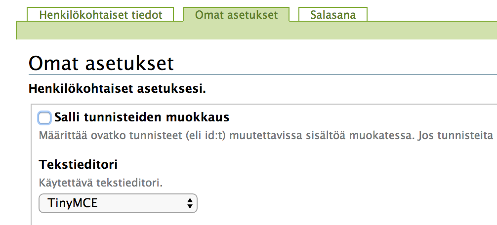
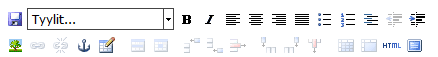

# Sivueditorin vaihtaminen

Uusimmassa piazzan versiossa pitäisi kaikilla olla automaattisesti __TinyMCE__ sivueditori valmiina.

Voi tarkistaa asian seuraavasti :

* avaa ylävalikosta __oman käyttäjätunnuksen__ alta löytyvä valikko
* valitse __Asetukset__
* valitse välilehti __Omat asetukset__

Tällä hetkellä ei ole käytössä muita kuin __TinyMCE__ editori.  Vanha __Kupu__ editori ei pitäisi enää näkyä missään.

----

## TinyMCE-editori

TinyMCE-editorin työkalupalkki näyttää tältä :

----
