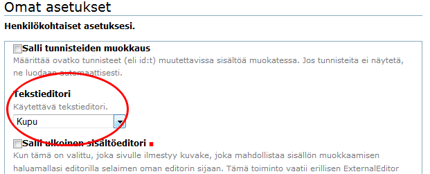
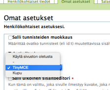
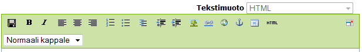

# Sivueditorin vaihtaminen

Vaihda sivueditori TinyMCE:ksi näin:

* Valitse Asetukset -> Omat asetukset
* vaihda __Kupu -> TinyMCE__

----

!!! note "Huom"
	Internet Explorer -käyttäjillä tulee olla tässä kohdassa TinyMCE jotta sivujen muokkaus onnistuu.

----

## TinyMCE-editori

TinyMCE-editorin työkalupalkki näyttää tältä :

----

## Kupu-editori

Jos dokumentit piazzalla ovat tiedostoina, on oletuseditori ___Kupu___  riittävä otsikoiden ja lyhyen kuvauksen laatimiseen.

Kupu-editorin työkalupalkki näyttää tältä :

----
