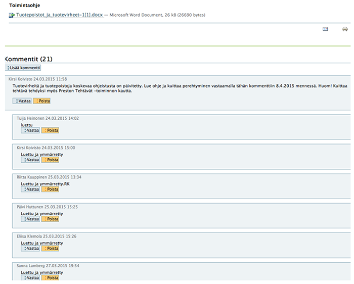

# Toimintaohjeet

## Taustaa 

Viime aikoina apteekkitarkastuksissa on tullut esille vaatimus viranomaissäädöksissä mainittujen toimintaohjeiden henkilökunnalle perehdyttämisestä.

Perehtyminen ko. toimintaohjeeseen jokaisen tulee kuitata allekirjoituksellaan ja päivämäärällä.

Toimintaohjeet tulee löytyä helposti ja ne tulee tarkistaa vuosittain.

----

## Pakolliset toimintaohjeet

Pakolliset toimintaohjeet mallipohjineen löytyvät salkusta _Laatutyökalu ja toimintaohjeet_.

Esimerkkejä toimintaohjeista, suluissa prosessi:

- Säilytysolosuhteiden seuranta (Logistiikka) 
- Lääkejätteiden käsittely (Puhtaanapito)
- Laitteiden käyttö, puhdistus ja kalibrointi 
- Karanteeniin ja raaka-aineiden ja pakkausmateriaalin hyväksymiseen tai hylkäämiseen liittyvät menettelyt 
- Lääkeneuvonta (Reseptiasiakas)
- Lääkeneuvonta (Itsehoitoasiakas)
- Toiminta apteekin ja reseptikeskuksen välisen yhteydenpidon häiriötilanteessa (Tietojärjestelmät)
- Tuotevirheet (Logistiikka)

Lisäksi toimintaohjeita lääkevalmistukseen, verkkoapteekkiin ja palvelupisteeseen.

----

## Ohjeiden nimeäminen ja hallinta

Seuraavassa on ehdotus ohjeiden nimeämisestä ja hallinnasta ajatuksena, että noudatetaan lainsäädäntöä, mutta hoidetaan se mahdollisimman vähällä byrokratialla.

### Ohjeiden nimeäminen

Toimintaohjeiksi nimetään vain ns. pakolliset salkussa luetellut ohjeet, muut ohjeet ovat apteekkiohjeita tai työohjeita, jolloin vain toimintaohjeiksi nimetyt ohjeet perehdytetään ja kuitataan luetuiksi.

### Ohjeiden arkistointi

Kaikki ohjeet säilytetään vain sähköisinä piazzalla (tarvittaessa työpisteessä tuloste, muistetaan myös sen päivitys), myös toimintaohjeiden kuittaaminen hoidetaan piazzalla.

Koska toimintaohjeet tulee löytyä helposti, laaditaan piazzalle sivuna toimintaohjeluettelo.

Luettelossa jokainen ohje linkitetään ko. toimintaohjeeseen, kts. [linkitys](dokumentin_tekeminen/#dokumenttien-linkitys).

Toimintaohjeet ja muut ohjeet ovat fyysisisesti ko. prosessin ohjekansiossa. Muutetaan tarvittaessa Toimintaohjeet -kansion nimet -> Ohjeet. 

### Toimintaohjeiden kuittaaminen

Toimintaohjeiden kuittaus hoidetaan sähköisesti piazzalla seuraavan esimerkin mukaisesti:

Toimintaohjeen laatija seuraa, että kaikki ao. ovat käyneet tutustumassa ja kuittaamassa.

Myös tulokkaat ja muut perehdytettävät käyvät kuittaamassa/kommentoimassa ohjeeseen tutustumisensa jälkeen.

Kuittaukset näkyvät myös Uusimmat kommentit muiden kommenttien joukossa.

Kun ohjetta päivitetään ja siitä infotaan, poistetaan vanhat kuittaukset ja lisätään uusi tutustumispyyntö em. mukaisesti.

Kommentteja voi poistaa piazzan ylläpitäjäoikeudet omaavat.

### Toimintaohjeiden tarkistaminen 

Kaikki toimintaohjeet ovat ydin- tai tärkeimmissä tukiprosesseissa.

Ne arvioidaan sisäisesti (auditoidaan) vuosittain, joten tämä riittänee viranomaismääräyksen vuosittaiseksi tarkistukseksi.

Arvioinnin muistioon maininta, että toimintaohjeet on tarkistettu, arviointiohjeen muuttaminen tältä osin.

----

